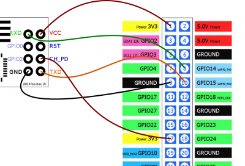

# Connect raspberry with ESP8266



Connect the raspberry with ESP8266 as the image above.

# Installing the firmware

Install the python serial
```
sudo apt-get install python3-serial python-pip
sudo pip install pyserial
```

Download esptool.py:
* [Esptool](https://github.com/themadinventor/esptool)

```
git clone git@github.com:themadinventor/esptool.git
```

Download NodeMCU:
* [NodeMCU](https://github.com/nodemcu/nodemcu-firmware/releases)

```
wget https://github.com/nodemcu/nodemcu-firmware/releases/download/0.9.6-dev_20150704/nodemcu_integer_0.9.6-dev_20150704.bin
```

connect ESP8266 to USBSerial (Connect the GPI0 to the ground):


To avoid problem with the tyAMA0 Serial on Raspberry, it needs to follow the approach below:

```
vim /etc/inittab
``` 

Comment:
> T0:23:respawn:/sbin/getty -L ttyAMA0 115200 vt100)

```
vim /boot/cmdline.txt
```

Remove:

> console=ttyAMA0,115200 kgdboc=ttyAMA0,115200

Reboot raspberry

[https://projects.drogon.net/raspberry-pi/wiringpi/pins/](https://projects.drogon.net/raspberry-pi/wiringpi/pins/)


Then, run:
```
./esptool.py --port=/dev/ttyAMA0 write_flash -fm=dio -fs=32m 0x00000 nodemcu_float_0.9.6-dev_20150704\ 2.bin
```

It will return:
> Connecting...
> 
> Erasing flash...
> 
> Wrote 462848 bytes at 0x00000000 in 45.4 seconds (81.6 kbit/s)...
> 
> 
> Leaving...

Disconnect and connect the USB again

* If the esptool didn't work and return "Failed to connect to ESP8266", try to desconnect and connect the 3.3V from the ESP.

# Send the script to ESP8266

Clone the luatool repository
```
git clone git@github.com:4refr0nt/luatool.git
cd luatool
./luatool/luatool.py --port /dev/ttyAMA0 --src ../water-sensor/raspberry.lua --dest init.lua --verbose
```

It should show at the end:

> --->>> All done <<<---

# Testing

Open Esplorer:
[Esplorer](http://esp8266.ru/esplorer/)

> java -jar ESPlorer.jar

[http://randomnerdtutorials.com/how-to-make-two-esp8266-talk/](http://randomnerdtutorials.com/how-to-make-two-esp8266-talk/)

# Useful Links

[https://projects.drogon.net/raspberry-pi/wiringpi/pins/](https://projects.drogon.net/raspberry-pi/wiringpi/pins/)

[http://randomnerdtutorials.com/how-to-make-two-esp8266-talk/](http://randomnerdtutorials.com/how-to-make-two-esp8266-talk/)